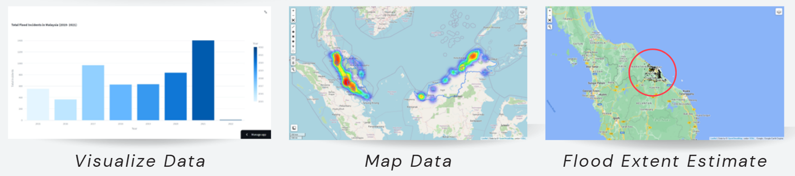

# Streamlit App For Flood Incidents in Malaysia <!-- omit in toc -->


[](https://floodmapv2-wnakuiqz4idj5pr4ugzemq.streamlit.app/)

An app powered by `Streamlit` to visualize the flood incidents in Malaysia from 2015 to 2021. 

**Table of Contents:**

- [Functions](#functions)
- [Flood Mapping Tool](#flood-mapping-tool)
- [Using this repository](#using-this-repository)
- [Resources](#resources)
- [References](#references)


## Functions
- Estimate the extent of a flood
- Visualize flood incidents' statistics
    - On bar chart, market cluster plot and heatmap



## Flood Mapping Tool
The web app contains a feature to allow user to estimate flood extent using Sentinel-1 synthetic-aperture radar SAR data. 

## Using this repository
1. Make sure you have installed all the packages in `requirements.txt`
2. If you are running this repo on your local Windows machine, you will probably encounter `fcntl module not found ` error. But this repo can still do fine on the web app
    - Go to [Google Earth Engine ](https://earthengine.google.com/) and create an account
    - Go to Windows terminal:
    ```python
    py -m pip install ee
    import ee
    ee.Authenticate()
    ```
    - You will need to paste the authorization code back on the terminal. Once the step is complete, you can find the token on your local machine at `C:\\Users\\Username\\.congif\\earthengine\\credentials`
3. Now assuming you have created an empty repository on you GitHub account and put everything in this repository there
    - Go to [Streamlit](https://streamlit.io/) and create an account there. Remember to link to your GitHub account. 
    - Then you need to deploy your repository you created just now. 
    - Before you click deploy, select advanced option and fill up the secret using the information in `C:\\Users\\Username\\.congif\\earthengine\\credentials`. You need to copy everything there. 
    ```toml
    EARTHENGINE_TOKEN = 'PASTE WHAT YOU COPY HERE'
    ee_keys = 'PASTE WHAT YOU COPY HERE'
    ```
## Resources
The flood incidents data is collected from the annual flood report published by the Department of Irrigation and Drainage. The report can be found here:

| Flood Annual Report | Link                                                                                         |
| ------------------- | -------------------------------------------------------------------------------------------- |
| 2015 Report         | [Link](https://info.water.gov.my/index.php/databank/view_attachment/5486)                    |
| 2016 Report         | [Link](http://h2o.water.gov.my/man_hp1/Banjir_Tahun1617.pdf)                                 |
| 2017 Report         | [link](http://h2o.water.gov.my/man_hp1/LBT2017-2018.pdf)                                     |
| 2018 Report         | [Link](http://h2o.water.gov.my/man_hp1/LBT2018_2019.pdf)                                     |
| 2019 Report         | [Link](http://h2o.water.gov.my/man_hp1/2019.pdf)                                             |
| 2020 Report         | [Link](http://h2o.water.gov.my/man_hp1/LBT2020.pdf)                                          |
| 2021 Report         | [Link](http://h2o.water.gov.my/man_hp1/LAPORAN%20BANJIR%20TAHUN%202021%20FINAL%20e-ISSN.pdf) |

## References
1. [mapaction/flood mapping tool](https://github.com/mapaction/flood-mapping-tool)
2. [opengeos/streamlit-geospatial](https://github.com/opengeos/streamlit-geospatial)

Internship Project © 2023
